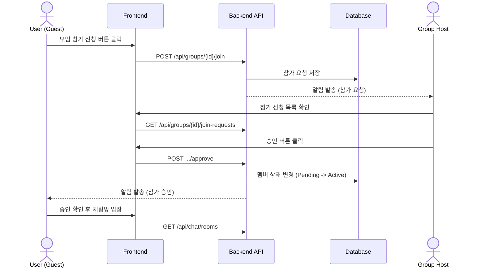
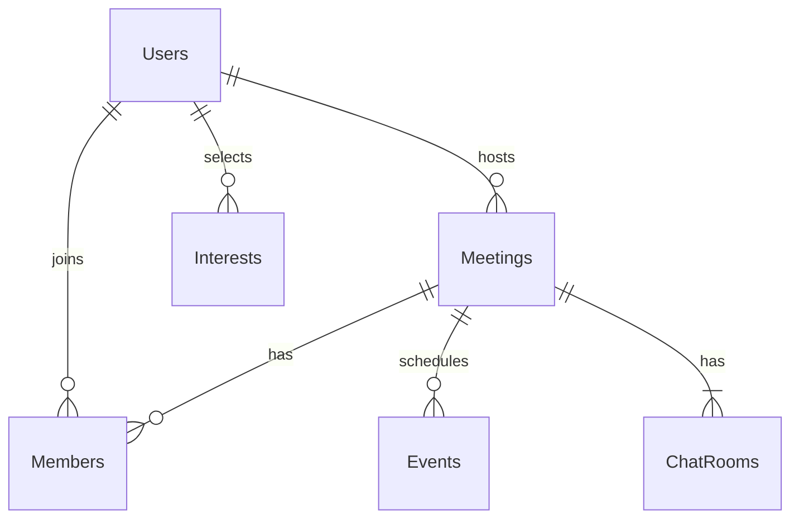
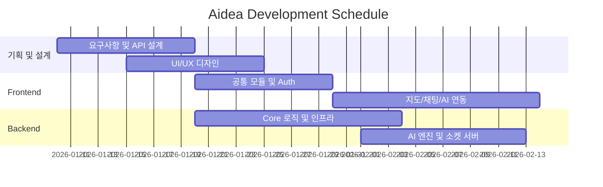

# 📍 Aidea

### **Location-based AI Short-form Meeting Platform**

> **"내 주변의 즐거움, 숏폼으로 탐색하고 AI로 똑똑하게 연결하세요."**

<div align="center">


<a href="[https://www.aidea.co.kr](https://www.aidea.co.kr)"><strong>🌐 Live Demo</strong></a> |
<a href="[http://aimo.ai.kr](http://aimo.ai.kr)"><strong>🔌 Backend API</strong></a> |
<a href="[https://github.com/your-repo/aidea](https://www.google.com/search?q=https://github.com/your-repo/aidea)"><strong>📁 Repository</strong></a>
</div>

---

## 📖 프로젝트 소개

**Aidea**는 위치 기반 기술과 AI 추천 시스템을 결합한 **하이브리드 모임 플랫폼**입니다. 기존의 텍스트 중심 모임 탐색에서 벗어나 **숏폼(Short-form)** UI를 통해 모임의 분위기를 직관적으로 파악하고, 개인화된 AI 알고리즘을 통해 최적의 커뮤니티를 매칭해 줍니다.

### 🎯 핵심 목표

* **Hyper-Local Integration**: 실시간 위치 좌표를 활용한 반경 내 모임 매칭
* **AI Personalization**: AWS Bedrock(Titan Embedding) 기반의 정교한 취향 분석
* **Visual Discovery**: 영상 및 카드 기반의 숏폼 UI로 즐거운 탐색 경험 제공
* **Seamless Interaction**: 실시간 채팅 및 일정 관리로 오프라인 만남까지 원스톱 지원

---

## 🛠 기술 스택 및 개발 환경

### 2.1 개발 환경

| 분류 | 기술 스택 | 상세 활용 |
| --- | --- | --- |
| **Frontend** | React 18, TypeScript, Vite | FSD 패턴 기반 아키텍처, 성능 최적화 |
| **Styling** | Tailwind CSS | 유틸리티 퍼스트 디자인, 모바일 최적화 UI |
| **State** | Zustand, TanStack Query | 클라이언트/서버 상태 관리 분리 및 캐싱 |
| **Backend** | Spring Boot 3.3, Java 17 | JPA/Hibernate, Spring Security (JWT) |
| **Database** | MySQL 8.0, Redis | 메인 데이터 저장 및 채팅/세션 캐싱 |
| **AI/Cloud** | AWS Bedrock, S3, CloudFront | 벡터 검색(Titan Embedding), 인프라 구축 |
| **API/Maps** | Kakao Maps, Swagger | 위치 기반 서비스 및 API 문서 자동화 |

### 2.2 테스트 계정

> **ID**: `test@aidea.com` / **PW**: `test1234!`

---

## 📡 API 명세 (URL 구조)

<details>
<summary><b>👤 User (사용자 및 인증)</b></summary>

| Method | URL | 설명 | 권한 |
| --- | --- | --- | --- |
| POST | `/api/users/join` | 회원가입 | - |
| POST | `/api/users/login` | 로그인 | - |
| GET | `/api/users/me` | 내 정보 조회 | ✅ |
| PATCH | `/api/users/me` | 내 정보 수정 | ✅ |
| PUT | `/api/users/interests` | 관심사 수정 | ✅ |
| POST | `/api/users/nickname-check` | 닉네임 중복 확인 | - |

</details>

<details>
<summary><b>🤝 Meeting & Event (모임 및 일정)</b></summary>

| Method | URL | 설명 | 권한 |
| --- | --- | --- | --- |
| GET | `/api/groups` | 모임 목록 조회 | - |
| POST | `/api/groups` | 모임 생성 | ✅ |
| GET | `/api/groups/{id}` | 모임 상세 조회 | - |
| POST | `/api/groups/{id}/join` | 모임 참가 신청 | ✅ |
| POST | `/api/groups/{id}/like` | 모임 찜하기 | ✅ |
| GET | `/api/groups/search` | 모임 검색 | - |
| GET | `/api/groups/{meetingId}/events` | 일정 목록 조회 | ✅ |
| POST | `/api/groups/{meetingId}/events` | 일정 생성 | ✅ |

</details>

<details>
<summary><b>💬 Chat & AI (채팅 및 추천)</b></summary>

| Method | URL | 설명 | 권한 |
| --- | --- | --- | --- |
| GET | `/api/chat/rooms` | 내 채팅방 목록 | ✅ |
| GET | `/api/chat/meetings/{mId}/messages` | 메시지 조회 | ✅ |
| POST | `/api/chat/rooms` | 채팅방 생성 | ✅ |
| GET | `/api/recommendations` | AI 기반 모임 추천 | ✅ |

</details>

---

## 🏗 시스템 설계

### 3.1 주요 흐름 (Sequence Diagram)



### 3.2 데이터베이스 모델링 (ERD)



---

## 📂 프로젝트 구조

### 4.1 Frontend (Feature-Sliced Design)

```bash
📦frontend
 ┣ 📂features           # 핵심 기능 단위 모듈 (auth, chat, map, meeting, recommendation 등)
 ┣ 📂routes             # 페이지 라우팅 설정
 ┣ 📂shared             # 공용 모듈 (api 클라이언트, 전역 타입, 유틸리티)
 ┣ 📂store              # 전역 상태 관리 (Zustand)
 ┗ 📂styles             # 전역 스타일링 (Tailwind)

```

### 4.2 Backend (Domain-Driven Design)

```bash
📦backend
 ┣ 📂domain              # 도메인별 비즈니스 로직
 ┃ ┣ 📂ai, 📂chat, 📂event, 📂meeting, 📂notification, 📂recommendation, 📂user 등
 ┗ 📂global              # 전역 공통 설정
   ┣ 📂config            # Security, Swagger, WebSocket 설정
   ┣ 📂error             # 예외 처리
   ┗ 📂secret            # JWT 및 OAuth 인증

```

---

## 🗓 개발 일정 (WBS)



---

## 👥 팀 구성 및 역할

| 이름 | 역할 | 담당 업무 |
| --- | --- | --- |
| **이세종** | **BE (팀장)** | DB 설계 총괄, DevOps 환경 구축, JWT/OAuth 보안 시스템 설계 |
| **김민규** | **BE** | 취향 분석 알고리즘 구현, 숏폼 데이터 서빙 최적화, 모임 CRUD |
| **방영진** | **BE** | WebSocket 실시간 채팅 서버, 알림 시스템, 카카오 API 연동 |
| **박영선** | **FE** | 숏폼 UI/인터랙션, 공통 UI 컴포넌트, 채팅 UI, 지도 연동 |
| **박유경** | **FE** | 카카오 맵/주소 검색 연동, 검색 필터, 마이페이지 및 모임 개설 폼 |

---

## 📸 주요 화면 (Wireframe)

<table>
<tr>
<td align="center"><b>1. 쇼츠 탐색</b></td>
<td align="center"><b>2. 로그인</b></td>
<td align="center"><b>3. 관심사 선택</b></td>
<td align="center"><b>4. 모임 상세</b></td>
</tr>
<tr>
<td></td>
<td></td>
<td></td>
<td></td>
</tr>
<tr>
<td align="center"><b>5. 채팅방</b></td>
<td align="center"><b>6. 마이페이지</b></td>
<td align="center"><b>7. 지도 탐색</b></td>
<td></td>
</tr>
<tr>
<td></td>
<td></td>
<td></td>
<td></td>
</tr>
</table>

---

## 🚀 문제 해결 (Troubleshooting)

### 🚨 N+1 쿼리 최적화 및 OOM 장애 해결

* **이슈**: 모임 상세 조회 시 정모 목록과 참가자 조회가 중첩되어 성능 저하 및 서버 다운 발생.
* **해결**: `@EntityGraph` 및 `Fetch Join` 도입으로 쿼리 수를 1~2개로 감소시켜 시스템 안정성 확보.

### 🗺️ 지도 드래그 성능 최적화

* **이슈**: 모바일 환경에서 잦은 지도 이동 시 API 호출 과부하 발생.
* **해결**: 마커 클러스터링 및 `Debounce` 처리를 통해 뷰포트 변경 완료 시에만 데이터를 동기화하도록 개선.

---

<div align="center">
<b>Made with ❤️ by Aidea Team</b>
</div>

---

**더 수정하거나 추가하고 싶은 부분이 있으시면 언제든 말씀해 주세요!**
