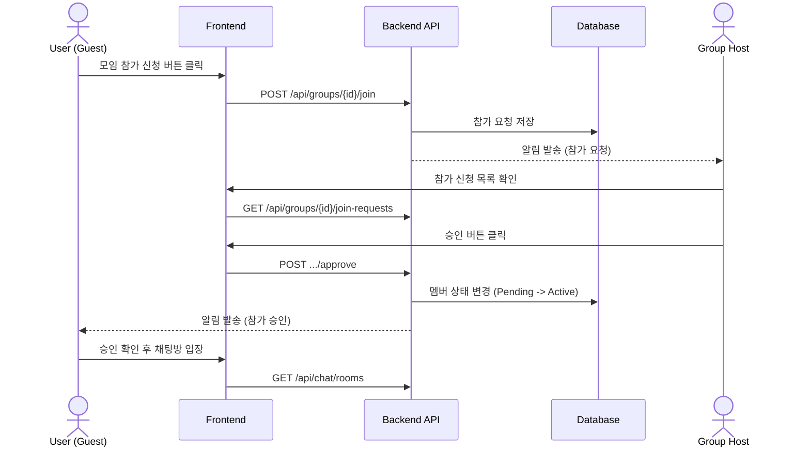
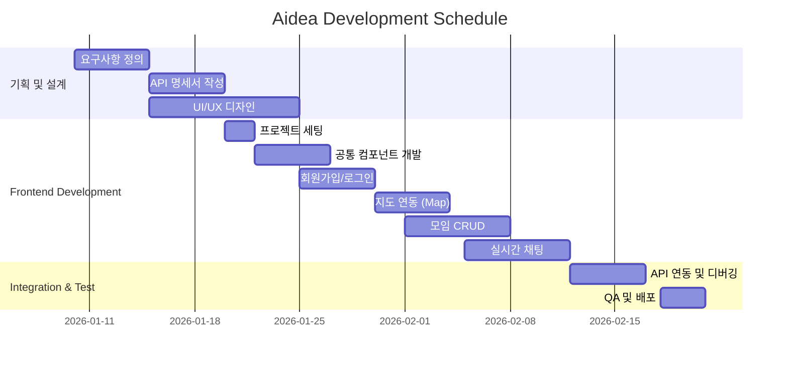
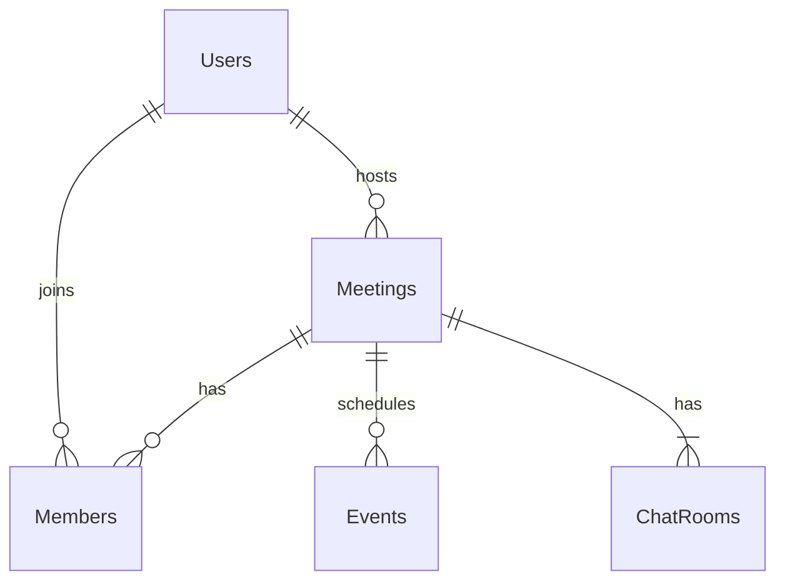

# 📍 Aidea (Location-based AI Short-form Meeting Platform)

<div align="center">
  
  
  
  
  
  
</div>

---

## 1. 목표와 기능

### 1.1 목표
- **위치 기반의 즉각적인 모임 연결**: 사용자의 현재 위치를 기반으로 주변의 흥미로운 모임을 빠르게 찾고 참여할 수 있는 플랫폼
- **AI 기반 맞춤형 추천**: 사용자의 관심사와 성향을 분석하여 최적의 모임과 카테고리를 추천
- **숏폼 형태의 모임 소개**: 직관적이고 빠른 정보 소비를 위한 숏폼(Short-form) 스타일의 모임 탐색 경험 제공
- **안전한 커뮤니티**: 신고 기능 및 신뢰도 기반의 유저 관리로 안전하게 즐길 수 있는 오프라인 만남 지향

### 1.2 기능
- **지도 기반 모임 탐색**: 지도 위에서 내 주변 모임을 직관적으로 확인 (Kakao Map 활용)
- **실시간 채팅**: 모임 참여자 간의 실시간 소통 및 일정 조율 (WebSocket/STOMP)
- **정모(Event) 관리**: 모임 내의 구체적인 약속 날짜와 장소를 관리하고 참여 의사 확인
- **관심사 및 AI 추천**: 사용자 관심사 기반의 그룹 추천 알고리즘 (AWS Bedrock/Titan Embedding)
- **알림 시스템**: 모임 신청/승인, 채팅, 찜하기 등 주요 활동에 대한 실시간 알림 서비스
- **공유 기능**: 링크를 통해 외부 플랫폼으로 손쉽게 모임 공유

---

## 2. 개발 환경 및 배포 URL

### 2.1 개발 환경
| 구분 | 기술 스택 |
| :--- | :--- |
| **Frontend** | React 18, TypeScript, Vite, Tailwind CSS, Zustand, TanStack Query |
| **Backend** | Spring Boot 3.3, Java 17, JPA/Hibernate, Spring Security |
| **Database** | MySQL 8.0, Redis (Chat/Session), AWS RDS |
| **Infra** | AWS EC2 (t3.medium), S3, CloudFront, GitHub Actions |
| **AI** | AWS Bedrock (Titan Text Embeddings v2) |
| **Maps** | Kakao Maps API |

### 2.2 배포 URL
- **Frontend**: [https://www.aidea.co.kr](https://www.aidea.co.kr) (예시)
- **Backend API**: [http://aimo.ai.kr](http://aimo.ai.kr)
- **테스트 계정**
  - ID: `test@aidea.com` / PW: `test1234!`

### 2.3 URL 구조 (API 명세)

**User (사용자)**
| Method | URL | 설명 | 권한 |
|:---:|:---|:---|:---:|
| POST | `/api/users/join` | 회원가입 | - |
| POST | `/api/users/login` | 로그인 | - |
| GET | `/api/users/me` | 내 정보 조회 | ✅ |
| PATCH | `/api/users/me` | 내 정보 수정 | ✅ |
| PUT | `/api/users/interests` | 관심사 수정 | ✅ |
| POST | `/api/users/nickname-check` | 닉네임 중복 확인 | - |

**Meeting (모임)**
| Method | URL | 설명 | 권한 |
|:---:|:---|:---|:---:|
| GET | `/api/groups` | 모임 목록 조회 | - |
| POST | `/api/groups` | 모임 생성 | ✅ |
| GET | `/api/groups/{id}` | 모임 상세 조회 | - |
| POST | `/api/groups/{id}/join` | 모임 참가 신청 | ✅ |
| POST | `/api/groups/{id}/like` | 모임 찜하기 | ✅ |
| GET | `/api/groups/search` | 모임 검색 | - |

**Event (정모/일정)**
| Method | URL | 설명 | 권한 |
|:---:|:---|:---|:---:|
| GET | `/api/groups/{meetingId}/events` | 일정 목록 조회 | ✅ |
| POST | `/api/groups/{meetingId}/events` | 일정 생성 | ✅ |
| POST | `/api/groups/{meetingId}/events/{eventId}/participate` | 일정 참석 | ✅ |

**Chat (채팅)**
| Method | URL | 설명 | 권한 |
|:---:|:---|:---|:---:|
| GET | `/api/chat/rooms` | 내 채팅방 목록 | ✅ |
| GET | `/api/chat/meetings/{meetingId}/messages` | 메시지 조회 | ✅ |
| POST | `/api/chat/rooms` | 채팅방 생성 | ✅ |

---

## 3. 요구사항 명세 및 기능 명세

### 3.1 주요 흐름 (Sequence Diagram)



---

## 4. 프로젝트 구조 및 개발 일정

### 4.1 프로젝트 구조 (Frontend - FSD 패턴)
```bash
📦frontend
 ┣ 📂src
 ┃ ┣ 📂features           # 핵심 기능 단위 (auth, chat, map, meeting, recommendation 등)
 ┃ ┣ 📂routes             # 페이지 라우팅
 ┃ ┣ 📂shared             # 공용 모듈 (api, components, hooks, utils)
 ┃ ┣ 📂store              # 전역 상태 관리 (Zustand)
 ┃ ┗ 📂styles             # 전역 스타일링 (Tailwind CSS)
```

### 4.2 프로젝트 구조 (Backend - Domain Driven)
```bash
📦backend
 ┣ 📂src/main/java/com/aidea/backend
 ┃ ┣ 📂domain              # 도메인별 비즈니스 로직
 ┃ ┃ ┣ 📂ai, 📂chat, 📂event, 📂meeting, 📂notification, 📂user 등
 ┃ ┗ 📂global              # 전역 공통 설정 (config, error, infra, secret)
```

### 4.3 개발 일정 (WBS)


---

## 5. 역할 분담

| 이름 | 역할 | 담당 업무 |
| :--- | :---: | :--- |
| **이세종** | BE (팀장) | DB 설계 및 API 명세 총괄, 배포(DevOps) 환경 구축, 보안(Auth) |
| **김민규** | BE | 추천 알고리즘 구현, 쇼츠 데이터 서빙 최적화, 모임 CRUD |
| **방영진** | BE | 실시간 채팅(Socket) 서버, 알림 시스템, 카카오 API 연동 |
| **박영선** | FE | 쇼츠 UI 및 인터랙션, 채팅 UI, 공통 컴포넌트 관리 |
| **박유경** | FE | 지도(Map) 연동, 검색 필터 UI, 모임 개설 폼 구현 |

---

## 6. 와이어프레임 / UI

### 6.1 주요 화면
<table>
    <tbody>
        <tr>
            <td align="center"><b>1. 쇼츠</b></td>
            <td align="center"><b>2. 로그인</b></td>
            <td align="center"><b>3. 관심사 선택</b></td>
            <td align="center"><b>4. 모임 상세</b></td>
        </tr>
        <tr>
            <td></td>
            <td></td>
            <td></td>
            <td></td>
        </tr>
        <tr>
            <td align="center"><b>5. 채팅방</b></td>
            <td align="center"><b>6. 마이페이지</b></td>
            <td align="center"><b>7. 지도</b></td>
            <td></td>
        </tr>
        <tr>
            <td></td>
            <td></td>
            <td></td>
            <td></td>
        </tr>
    </tbody>
</table>

---

## 7. 데이터베이스 모델링 (ERD)



---

## 8. 시스템 아키텍처 (Architecture)

```mermaid
graph TD;
    Client[Client (React PWA)] -->|HTTPS| CF[AWS CloudFront]
    CF --> API[API Server (Spring Boot)]
    
    subgraph Backend Services
        API --> DB[(MySQL RDS)]
        API --> Redis[(Redis - Cache)]
        API --> AI[AI Recommendation Engine]
    end
    
    subgraph External APIs
        Client --> Map[Kakao Map API]
        API --> Auth[OAuth Provider]
    end
    
    Client <--- WebSocket ---> API
```

---

## 9. 핵심 기능 설명

1.  **위치 기반 모임 매칭**: 사용자의 실시간 경위도 좌표를 이용하여, 반경 N km 이내의 모임을 지도상에 마커로 표시합니다.
2.  **숏폼 UI**: 시각적인 즐거움을 위해 숏폼 카드 형태로 모임 정보를 제공하여 빠른 탐색 경험을 선사합니다.
3.  **실시간 모임 관리**: 모임장은 '정모(Event)'를 생성하고, 멤버들은 참석 여부를 즉시 투표하며 실시간으로 결과를 확인합니다.
4.  **안전 시스템**: 신고/차단 기능을 통해 건전한 커뮤니티 문화를 유지할 수 있는 프로세스를 구축했습니다.
5.  **실시간 채팅 및 알림**: WebSocket을 활용한 1:N 채팅과 모임 신청/승인 시 발생하는 실시간 알림 서비스를 제공합니다.

---

## 10. 문제 해결 (Troubleshooting)

### 🚨 N+1 쿼리 최적화 및 OOM 장애 해결
- **이슈**: 모임 상세 조회 시 정모 목록과 참가자 조회가 중첩되어 200여 개의 쿼리가 동시 발생, 메모리 부족(OOM)으로 서버 다운.
- **해결**: `@EntityGraph` 및 `Fetch Join`을 도입하여 단일 쿼리로 최적화. 쿼리 수를 1-2개로 감소시켜 시스템 안전성 확보.
- **예방**: JVM Memory Limit 설정 및 보안 그룹을 통한 외부 API 직접 호출 차단.

### 🗺️ 지도 드래그 성능 최적화
- **이슈**: 모바일 환경에서 지도 이동 시 잦은 API 호출로 인한 성능 저하.
- **해결**: 마커 클러스터링 도입 및 `Debounce` 처리를 통해 뷰포트 변경 완료 시에만 데이터 동기화.

---

## 11. 회고 및 느낀점

- **FE**: 지도 API와 복잡한 React 상태 간의 동기화, 특히 실시간 채팅 데이터의 낙관적 업데이트(Optimistic Update) 구현을 통해 사용자 경험의 깊이를 더했습니다.
- **BE**: 대규모 데이터 조인 상황에서의 성능 병목을 해결하고, 인프라 리소스 제한의 중요성을 실무적으로 깨달은 프로젝트였습니다.
를 통해 응답 속도를 개선하는 경험을 했습니다.

