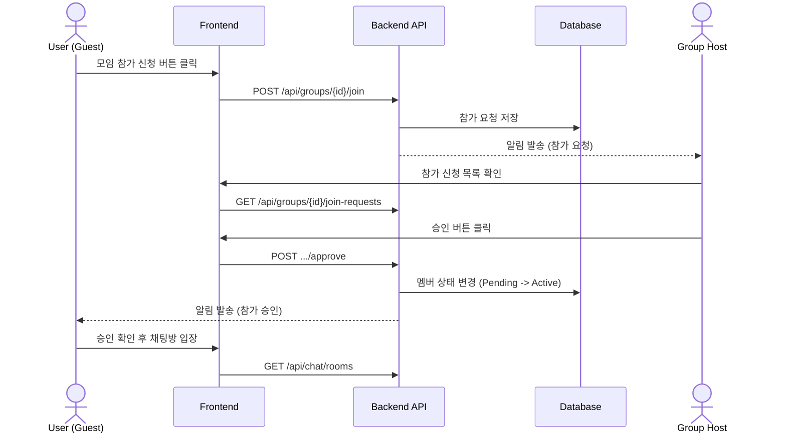
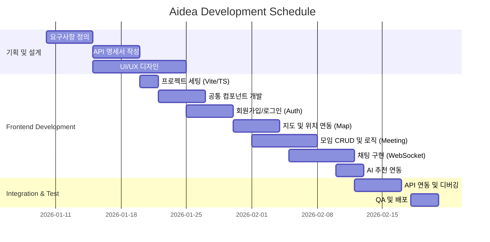
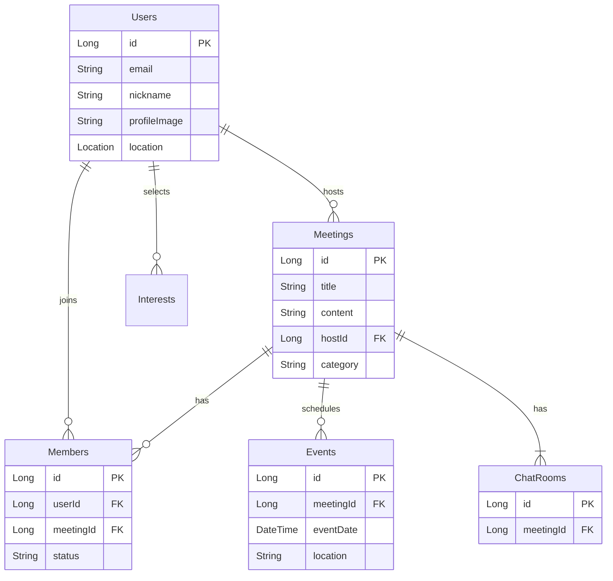

# Aidea (Location-based AI Short-form Meeting Platform)

## 1. 목표와 기능

### 1.1 목표
- **위치 기반의 즉각적인 모임 연결**: 사용자의 현재 위치를 기반으로 주변의 흥미로운 모임을 빠르게 찾고 참여할 수 있는 플랫폼
- **AI 기반 맞춤형 추천**: 사용자의 관심사와 성향을 분석하여 최적의 모임과 카테고리를 추천
- **숏폼 형태의 모임 소개**: 직관적이고 빠른 정보 소비를 위한 숏폼(Short-form) 스타일의 모임 탐색 경험 제공
- **안전한 커뮤니티**: 신고 기능 및 신뢰도 기반의 유저 관리로 안전하게 즐길 수 있는 오프라인 만남 지향

### 1.2 기능
- **지도 기반 모임 탐색**: 지도 위에서 내 주변 모임을 직관적으로 확인 (Kakao Map 활용)
- **실시간 채팅**: 모임 참여자 간의 실시간 소통 및 일정 조율
- **정모(Event) 관리**: 모임 내의 구체적인 약속 날짜와 장소를 관리하고 참여 의사 확인
- **관심사 및 AI 추천**: 사용자의 관심사를 기반으로 한 그룹 추천 알고리즘 적용
- **공유 기능**: 링크를 통해 외부 플랫폼으로 손쉽게 모임 공유

### 1.3 팀 구성
<table>
	<tr>
		<th>팀장 (BE)</th>
		<th>FE</th>
		<th>FE</th>
		<th>BE</th>
        <th>BE</th>
	</tr>
 	<tr>
		<td>이세종</td>
		<td>박영선</td>
		<td>박유경</td>
        <td>김민규</td>
        <td>방영진</td>
	</tr>
</table>

## 2. 개발 환경 및 배포 URL

### 2.1 개발 환경
- **Frontend**
  - Language: TypeScript
  - Framework: React 18
  - Build Tool: Vite
  - Styling: Tailwind CSS
  - State Management: Zustand (Store 폴더 참조)
  - Map API: Kakao Maps API
- **Backend (API 기준 추정)**
  - Server: Spring Boot
  - Database: MySQL / Redis (Chat)
  - Docs: Swagger/OAS 3.0
- **AI**
  - Recommendation Engine (Embedding Test Controller 참조)

### 2.2 배포 URL
- **Frontend**: https://www.aidea.co.kr (예시)
- **Backend API**: http://aimo.ai.kr
- **Test Account**
  ```
  id : test@aidea.com
  pw : test1234!
  ```

### 2.3 URL 구조 (API 명세 기반)

**User (사용자)**

| Method | URL | 설명 | 권한 |
|:---:|:---|:---|:---:|
| POST | `/api/users/join` | 회원가입 | - |
| POST | `/api/users/login` | 로그인 | - |
| GET | `/api/users/me` | 내 정보 조회 | ✅ |
| PATCH | `/api/users/me` | 내 정보 수정 | ✅ |
| PUT | `/api/users/interests` | 관심사 수정 | ✅ |
| POST | `/api/users/nickname-check` | 닉네임 중복 확인 | - |

**Meeting (모임)**

| Method | URL | 설명 | 권한 |
|:---:|:---|:---|:---:|
| GET | `/api/groups` | 모임 목록 조회 | - |
| POST | `/api/groups` | 모임 생성 | ✅ |
| GET | `/api/groups/{id}` | 모임 상세 조회 | - |
| POST | `/api/groups/{id}/join` | 모임 참가 신청 | ✅ |
| POST | `/api/groups/{id}/like` | 모임 찜하기 | ✅ |
| GET | `/api/groups/search` | 모임 검색 | - |

**Event (정모/일정)**

| Method | URL | 설명 | 권한 |
|:---:|:---|:---|:---:|
| GET | `/api/groups/{meetingId}/events` | 일정 목록 조회 | ✅ |
| POST | `/api/groups/{meetingId}/events` | 일정 생성 | ✅ |
| POST | `/api/groups/{meetingId}/events/{eventId}/participate` | 일정 참석 | ✅ |

**Chat (채팅)**

| Method | URL | 설명 | 권한 |
|:---:|:---|:---|:---:|
| GET | `/api/chat/rooms` | 내 채팅방 목록 | ✅ |
| GET | `/api/chat/meetings/{meetingId}/messages` | 메시지 조회 | ✅ |
| POST | `/api/chat/rooms` | 채팅방 생성 | ✅ |

**Recommendation (추천)**

| Method | URL | 설명 | 권한 |
|:---:|:---|:---|:---:|
| GET | `/api/recommendations` | AI 기반 모임 추천 | ✅ |

## 3. 요구사항 명세와 기능 명세

### 3.1 주요 흐름 (Sequence Diagram)
모임 참가 및 승인 프로세스 예시입니다.



   
## 4. 프로젝트 구조와 개발 일정

### 4.1 프로젝트 구조 (Frontend)
Feature-Slices Design 패턴을 차용하여 기능별(features)로 응집도 높게 구성하였습니다.

```bash
📦frontend
 ┣ 📂public
 ┣ 📂src
 ┃ ┣ 📂assets
 ┃ ┣ 📂features           # 핵심 기능 단위 모듈
 ┃ ┃ ┣ 📂auth             # 인증 (로그인, 회원가입)
 ┃ ┃ ┣ 📂chat             # 채팅 (채팅방, 메시지)
 ┃ ┃ ┣ 📂map              # 지도 (위치 표시, 마커)
 ┃ ┃ ┣ 📂meeting          # 모임 (생성, 조회, 정모 관리)
 ┃ ┃ ┣ 📂mypage           # 마이페이지
 ┃ ┃ ┣ 📂onboarding       # 초기 진입
 ┃ ┃ ┣ 📂profile          # 프로필
 ┃ ┃ ┗ 📂recommendation   # 추천 시스템
 ┃ ┣ 📂routes             # 라우팅 설정
 ┃ ┣ 📂shared             # 공용 모듈
 ┃ ┃ ┣ 📂api              # API 클라이언트 및 엔드포인트
 ┃ ┃ ┣ 📂components       # UI 컴포넌트 (Button, Input 등)
 ┃ ┃ ┣ 📂config           # 상수 및 환경설정
 ┃ ┃ ┣ 📂types            # 전역 타입 정의 (DTO 등)
 ┃ ┃ ┗ 📂utils            # 유틸리티 함수 (WebSocket 등)
 ┃ ┣ 📂store              # 전역 상태 관리 (Zustand 등)
 ┃ ┣ 📂styles             # 전역 스타일 (Tailwind 설정 등)
 ┃ ┣ 📜App.tsx
 ┃ ┗ 📜main.tsx
 ┣ 📜eslint.config.js
 ┣ 📜package.json
 ┣ 📜tailwind.config.js
 ┣ 📜tsconfig.json
 ┗ 📜vite.config.ts
```

### 4.2 프로젝트 구조 (Backend)
다운로드된 개발 브랜치의 실제 디렉토리 구조를 반영한 백엔드 구조입니다.

```bash
📦backend
 ┣ 📂src
 ┃ ┣ 📂main
 ┃ ┃ ┣ 📂java
 ┃ ┃ ┃ ┗ 📂com
 ┃ ┃ ┃ ┃ ┗ 📂aidea
 ┃ ┃ ┃ ┃ ┃ ┗ 📂backend
 ┃ ┃ ┃ ┃ ┃ ┃ ┣ 📂domain              # 도메인별 비즈니스 로직
 ┃ ┃ ┃ ┃ ┃ ┃ ┃ ┣ 📂ai                # AI 서비스 (Bedrock, Titan Embedding)
 ┃ ┃ ┃ ┃ ┃ ┃ ┃ ┣ 📂chat              # 채팅 (WebSocket, Message, Room)
 ┃ ┃ ┃ ┃ ┃ ┃ ┃ ┣ 📂event             # 모임 일정/이벤트
 ┃ ┃ ┃ ┃ ┃ ┃ ┃ ┣ 📂interest          # 사용자 관심사
 ┃ ┃ ┃ ┃ ┃ ┃ ┃ ┣ 📂meeting           # 모임(Meeting) 핵심 로직
 ┃ ┃ ┃ ┃ ┃ ┃ ┃ ┣ 📂notification      # 알림 서비스
 ┃ ┃ ┃ ┃ ┃ ┃ ┃ ┣ 📂recommendation    # AI 추천/벡터 검색
 ┃ ┃ ┃ ┃ ┃ ┃ ┃ ┣ 📂review            # 리뷰/후기
 ┃ ┃ ┃ ┃ ┃ ┃ ┃ ┣ 📂safety            # 신고/차단
 ┃ ┃ ┃ ┃ ┃ ┃ ┃ ┗ 📂user              # 사용자/프로필
 ┃ ┃ ┃ ┃ ┃ ┃ ┗ 📂global              # 전역 공통 설정
 ┃ ┃ ┃ ┃ ┃ ┃ ┃ ┣ 📂common            # 공통 응답/DTO
 ┃ ┃ ┃ ┃ ┃ ┃ ┃ ┣ 📂config            # 설정 (Security, Swagger, WebSocket 등)
 ┃ ┃ ┃ ┃ ┃ ┃ ┃ ┣ 📂error             # 예외 처리
 ┃ ┃ ┃ ┃ ┃ ┃ ┃ ┣ 📂infra             # 외부 인프라 (S3)
 ┃ ┃ ┃ ┃ ┃ ┃ ┃ ┗ 📂secret            # 인증/인가 (JWT, OAuth)
```

### 4.3 개발 일정 (WBS)


## 5. 역할 분담

- **이세종 (팀장/BE)** : DB 설계 및 API 명세 총괄, 배포(DevOps) 환경 구축, 회원 인증(Auth) 보안 담당
- **김민규 (BE)** : 사용자 취향 분석 및 추천 알고리즘 구현, 쇼츠 데이터 서빙 최적화, 모임 CRUD
- **방영진 (BE)** : 실시간 채팅(Socket) 서버 구현, 카카오 API(지도/공유) 백엔드 로직 처리, 알림 시스템
- **박영선 (FE)** : 쇼츠(Shorts) UI 및 인터랙션 구현, 로그인/회원가입, 공통 컴포넌트 관리, 채팅방 UI, 카카오 맵(Map) 및 주소 검색 연동
- **박유경 (FE)** : 카카오 맵(Map) 및 주소 검색 연동, 필터 검색 UI, 마이페이지 및 모임 개설 폼 구현

## 6. 와이어프레임 / UI

### 6.1 주요 화면
<table>
    <tbody>
        <tr>
            <td align="center"><b>1. 쇼츠</b></td>
            <td align="center"><b>2. 로그인</b></td>
            <td align="center"><b>3. 관심사 선택</b></td>
            <td align="center"><b>4. 모임 상세</b></td>
        </tr>
        <tr>
            <td></td>
            <td></td>
            <td></td>
            <td></td>
        </tr>
        <tr>
            <td align="center"><b>5. 채팅방</b></td>
            <td align="center"><b>6. 마이페이지</b></td>
            <td align="center"><b>7. 지도</b></td>
            <td></td>
        </tr>
        <tr>
            <td></td>
            <td></td>
            <td></td>
            <td></td>
        </tr>
    </tbody>
</table>

## 7. 데이터베이스 모델링 (ERD)

API 명세서를 기반으로 추정한 핵심 엔티티 관계도입니다.



## 8. Architecture
```mermaid
graph TD;
    Client[Client (React PWA)] -->|HTTPS| LB[Load Balancer]
    LB --> API[API Server (Spring Boot)]
    
    subgraph Backend Services
        API --> DB[(MySQL)]
        API --> Redis[(Redis - Cache/Session)]
        API --> AI[AI Recommendation Engine]
    end
    
    subgraph External APIs
        Client --> Map[Kakao Map API]
        API --> Auth[OAuth Provider (Kakao/Google)]
    end
    
    Client <-->|WebSocket| API
```

## 9. 핵심 기능 설명

1.  **위치 기반 모임 매칭**: 사용자의 실시간 경위도 좌표를 이용하여, 반경 N km 이내의 활성화된 모임을 지도상에 마커로 표시합니다.
2.  **숏폼 UI**: 모임을 클릭하면 핵심 정보(이미지, 요약)가 숏폼 카드 형태로 노출되어 빠르게 넘겨보며 탐색할 수 있습니다.
3.  **실시간 모임 관리**: 모임장은 '정모(Event)'를 생성하고, 멤버들은 참석/불참 버튼으로 즉시 의사를 표현하며, 이는 실시간으로 반영됩니다.
4.  **안전 시스템**: 신고하기 기능을 통해 불쾌한 유저나 모임을 제재할 수 있는 프로세스가 구축되어 있습니다.
5.  **실시간 채팅**: 모임별 채팅방을 통해 멤버들 간의 실시간 소통이 가능하며, WebSocket을 활용하여 메시지 전송 지연을 최소화했습니다. 이전 대화 내역 저장 및 읽음 처리 기능도 지원합니다.

## 10. 문제 해결 (Troubleshooting)

- **이슈**: 모바일 환경에서 지도 드래그 시 성능 저하 발생
  - **해결**: 마커 클러스터링(Clustering) 도입 및 뷰포트 변경 시에만 API를 재호출하도록 Debounce 처리 적용
- **이슈**: 실시간 채팅 메시지 순서 보장 문제
  - **해결**: 메시지 생성 시간을 기준으로 정렬하되, Socket 응답 지연 시 로컬 낙관적 업데이트(Optimistic Update) 적용 후 서버 동기화

## 11. 회고 및 느낀점

- **FE**: 기획 단계부터 참여하여 위치 기반 서비스의 실제 사용성을 고민할 수 있었습니다. 특히 지도 API와 React 상태 관리의 동기화 부분에서 많은 학습이 되었습니다.
- **BE**: 복잡한 다대다 관계(유저-모임-일정)를 효율적으로 설계하고, 쿼리 최적화를 통해 응답 속도를 개선하는 경험을 했습니다.

